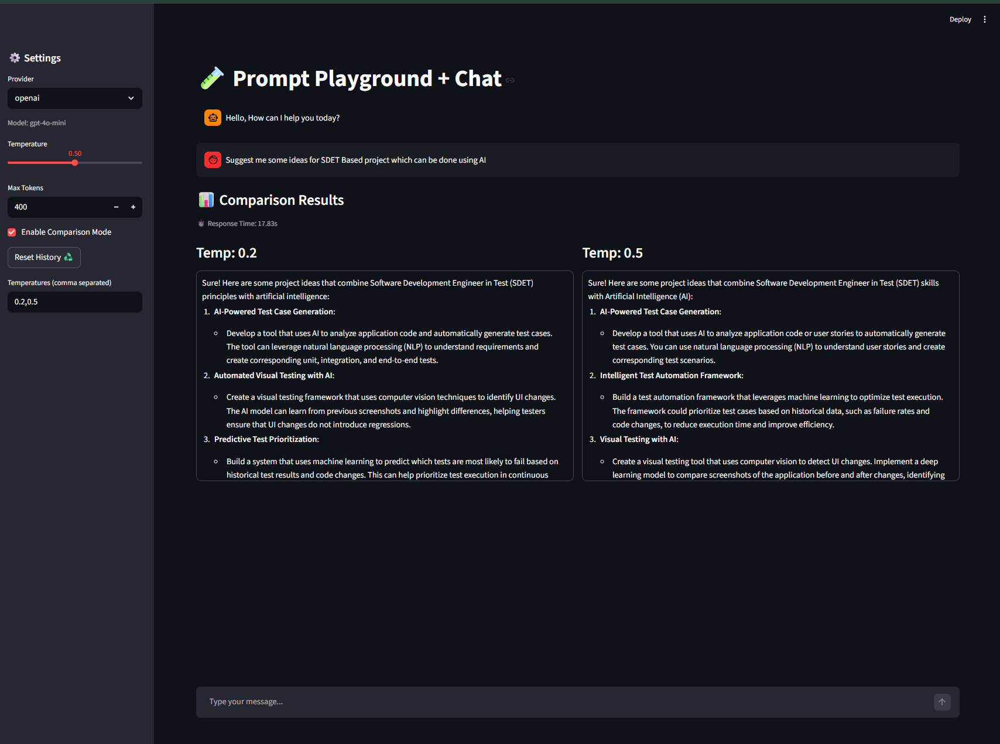

# 🧪 Prompt Playground + Chat (Multi-LLM)

A **GenAI experimentation tool** to understand how Large Language Models behave with different parameters, prompts, and providers.

This project allows you to:

* Interact with AI models in a **ChatGPT-like UI**
* Experiment with **temperature, max tokens**
* Compare outputs across different settings
* Work with **multiple LLM providers (OpenAI + Gemini)**

---

## 🚀 Features

### 💬 Chat Interface

* ChatGPT-style UI using Streamlit
* Maintains **conversation history (context-aware responses)**
* Reset chat anytime

### ⚙️ Parameter Tuning

* Adjust:

  * `temperature` → randomness
  * `max_tokens` → response length
* Understand how parameters affect output

### 📊 Comparison Mode

* Compare responses for multiple temperatures simultaneously
* Example: `0.2 vs 0.5 vs 1.0`

### 🔄 Multi-Provider Support

* OpenAI (GPT models)
* Gemini (Google models)
* Easily switch providers via config

### 🧠 Context Memory Handling

* Maintains last N messages for better responses
* Demonstrates real-world **LLM memory management**

---

## 🏗️ Tech Stack

* **Python**
* **Streamlit** (UI)
* **OpenAI API**
* **Google Gemini API**
* **dotenv** (environment management)

---

## 📁 Project Structure

```
prompt_playground/
│
├── app.py                # Streamlit UI
├── llm_provider.py       # Multi-LLM abstraction layer
├── config.json           # Model configuration
├── history.json          # Saved conversations (optional)
├── .env                  # API keys
```

---

## ⚙️ Setup Instructions

### 1️⃣ Clone the repo

```bash
git clone https://github.com/your-username/prompt-playground.git
cd prompt-playground
```

---

### 2️⃣ Install dependencies

```bash
pip install streamlit openai google-generativeai python-dotenv
```

---

### 3️⃣ Add API Keys

Create a `.env` file:

```env
OPENAI_API_KEY=your_openai_key
GEMINI_API_KEY=your_gemini_key
```

---

### 4️⃣ Run the app

```bash
streamlit run app.py
```

---

## 🧠 How It Works

### 🔹 Chat Flow

* User input → stored in session history
* Last N messages → sent to LLM
* Model generates context-aware response

### 🔹 Comparison Mode

* Same prompt sent with different temperatures
* Outputs displayed side-by-side

### 🔹 Provider Abstraction

* `LLM_Provider` class handles:

  * OpenAI API calls
  * Gemini API calls
* Allows easy extension to other models

---

## 🧪 Example Use Cases

* Understand **LLM behavior (temperature vs output)**
* Learn **prompt engineering**
* Build intuition for **AI system design**
* Compare model outputs across providers
* Debug LLM inconsistencies

---

## 📸 Demo


---

## 🎯 Key Learnings

This project demonstrates:

* Prompt engineering fundamentals
* LLM parameter tuning
* Context/memory handling
* Multi-model architecture
* Differences in model behavior (OpenAI vs Gemini)

---

## 🚀 Future Improvements

* Add **streaming responses**
* Add **token usage tracking**
* Add **prompt templates**
* Add **response export (PDF/JSON)**
* Add **RAG (Retrieval-Augmented Generation)**

---

## 👨‍💻 Author

**Mayank Joshi**

---

## ⭐ If you found this useful

Give it a star ⭐ and feel free to fork & improve!
